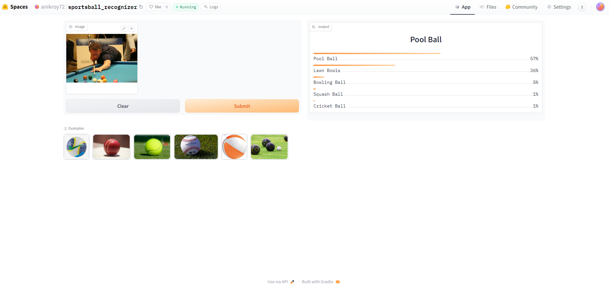
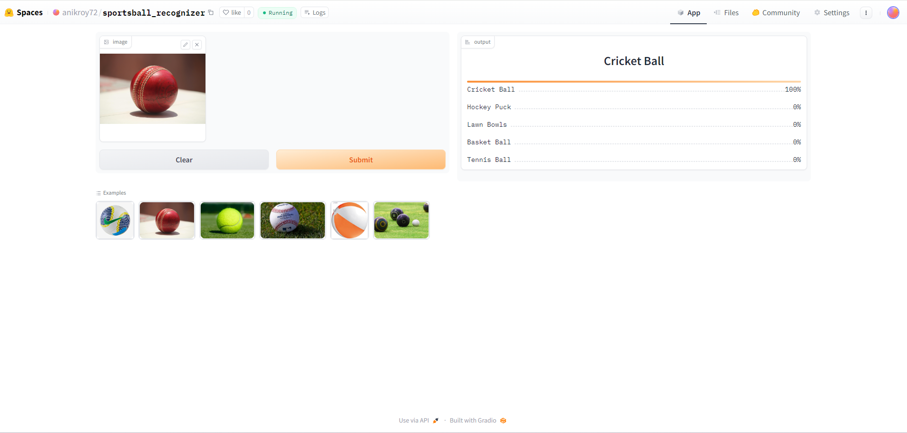
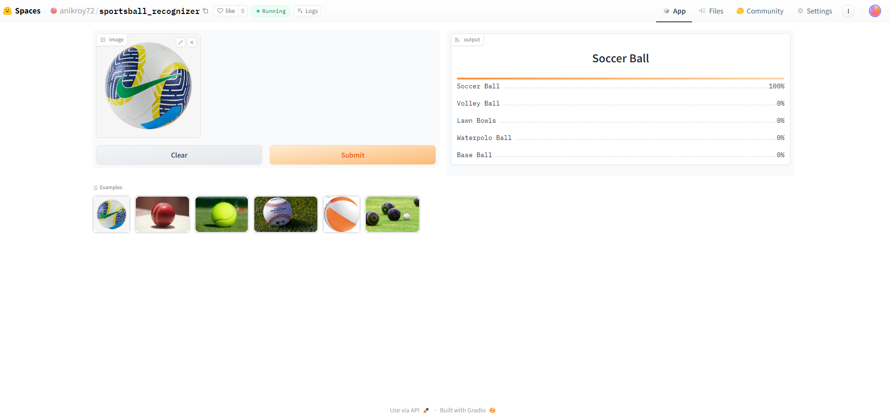

# Sports Ball Recognizer
# Data Overviwe
Total of 3364 images of 19 different types of sports ball has been scraped. data folder contains the datapath.
An image classification model from data collection, cleaning, model training, deployment and API integration. <br/>
The goal of this project is to classify 19 different types of Sports Ball are played in different sports all over the world. <br/>
The types are following: <br/>
1. Soccer Ball
2. American Football
3. Tennis Ball
4. Base Ball
5. Volleyball
6. Bowling Ball
7. Golf Ball
8. Beach Ball
9. Pool Ball
10. Hockey Puck
11. Badminton
12. Water Polo
13. Squash
14. Wiffleball
15. Cricket Ball
16. Sepak Takraw
17. Table Tennis Ball
18. taqiyah cap
19. Basket Ball
20. Lawn Bowls

# Build From Sources

**Clone the repo**
```bash
git clone https://github.com/Roy72/Sportsball_recognizer.git
```

# Dataset Preparation
**Data Collection:** Downloaded from DuckDuckGo using term name <br/>
**DataLoader:** Used fastai DataBlock API to set up the DataLoader. <br/>
**Data Augmentation:** fastai provides default data augmentation which operates in GPU. <br/>
Details can be found in `notbooks\README.md`, where `data_prep.ipynb` can be found.

# Training and Data Cleaning
**Training:** Fine-tuned a resnet34 model for 5 epochs (1 time) & 2 epochs (2 times) and got upto ~98% accuracy. <br/>
**Data Cleaning:** This part took the highest time. Since I collected data from browser, there were many noises. Also, there were images that contained. I cleaned and updated data using fastai ImageClassifierCleaner. I cleaned the data each time after training or finetuning, except for the last time which was the final iteration of the model. <br/>
**Confusion Matrix:** This matrix shows the how much the model can accurately predict the images. After training the final model confusion matrix seems fine. <br/>
 <br/>
Deatils can be found in `notbooks\README.md`,where `training_and_data_cleaning.ipynb` can be found.

# Model Deployment
I deployed to model to HuggingFace Spaces Gradio App. The implementation can be found in `deployment` folder or [here](https://huggingface.co/spaces/anikroy72/sportsball_recognizer?logs=build). <br/>

For Lwan Bowls <br/>
 <br/>

For Poolball<br/>
 <br/>

For Cricket Ball<br/>
 <br/>

For  Football<br/>
 <br/>

# API integration with GitHub Pages
The deployed model API is integrated [here](https://roy72.github.io/Sportsball_recognizer/) in GitHub Pages Website. Implementation and other details can be found in `docs` folder.

**Thanks for observing my project on SprotsBall Recognizer. For any kind of query and suggestion contact with my mail address : anik.roya11@gmail.com**
